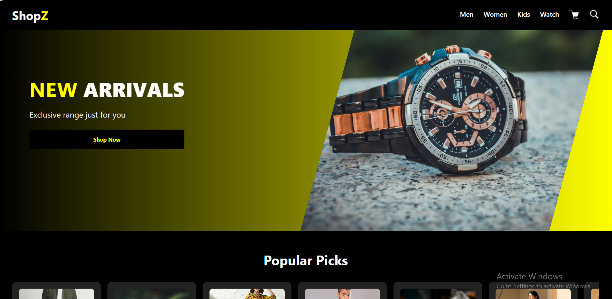
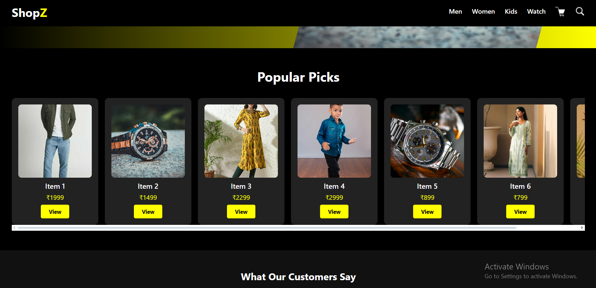
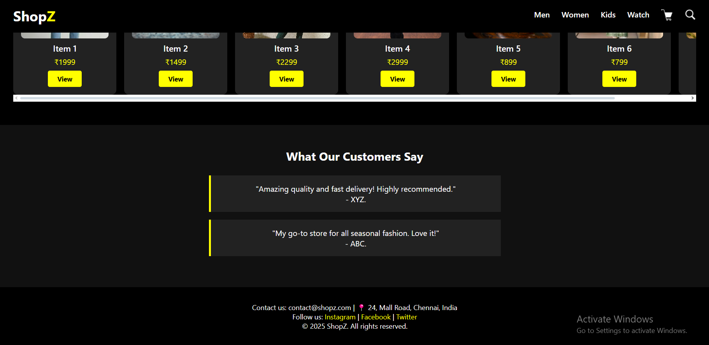

#  ShopZ - E-commerce Homepage

Welcome to **ShopZ**, a sleek and responsive E-commerce homepage designed with **HTML** and **CSS**.  
It features a modern layout with a hero section, carousel for popular items, customer testimonials, and a clean footer.

---

##  Project Structure

```
ecom/
├── index.html
├── style.css
└── assets/
    ├── watch1.jpg
    ├── watch2.jpg
    ├── boy1.jpg
    ├── boy2.jpg
    ├── girl1.jpg
    ├── girl2.jpeg
    ├── girl3.jpg
    ├── sc1.png
    └── sc2.png
```

---

##  Features

-  Responsive  
-  Hero Banner   
-  "Popular Picks" Horizontal Scroll Carousel  
-  Testimonials Section  
-  Minimalistic Footer  


---

##  How to Run

1. **Clone the Repository / Download the Folder**
   ```bash
   git clone <repo-url>
   ```

2. **Navigate to the Project Directory**
   ```bash
   cd ecom
   ```

3. **Open `index.html` in your browser**

   - You can also use **Live Server** (VS Code extension) for auto-refresh.

---

## Preview








---

##  Notes

- All product and UI images are placed inside the `assets/` folder.
- Responsiveness is handled with `@media` queries for devices below `768px`.

---

##  Learnings

Through this project:

- HTML semantics & page structure  
- CSS Flexbox for layout  
- CSS transforms and responsiveness  
- Creating carousels using `overflow-x: auto`  

---


